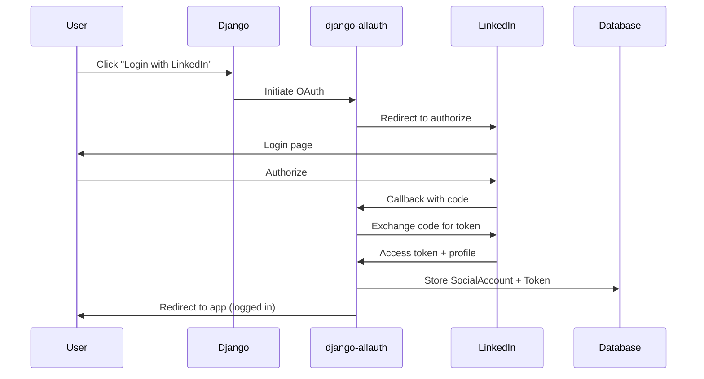

# ADR-003: OAuth Authentication Strategy with django-allauth

**Status**: Accepted

**Date**: 2024 (inferred from project creation)

**Decision Makers**: Mohamed Hossam

## Context

The application requires users to connect their LinkedIn accounts to enable automated posting. This requires:
- OAuth 2.0 integration with LinkedIn
- Secure storage of access tokens
- Token retrieval for API calls
- Support for OpenID Connect
- User account linking (Django user ↔ LinkedIn account)

**Requirements**:
- OAuth 2.0 / OpenID Connect support
- Automatic token storage
- Django admin integration
- Social account management
- Simple configuration

**Alternatives Considered**:
1. **django-allauth** (chosen)
2. **python-social-auth / social-auth-app-django**
3. **Custom OAuth implementation**
4. **OAuth2 library (Authlib, requests-oauthlib) + custom integration**

## Decision

Use **django-allauth** with OpenID Connect provider for LinkedIn OAuth integration.

## Rationale

### Chosen Approach: django-allauth

**Advantages**:
- ✅ Comprehensive OAuth provider support (50+ providers)
- ✅ Automatic token storage in database
- ✅ Built-in social account management
- ✅ OpenID Connect support (required for LinkedIn)
- ✅ Well-maintained, production-tested
- ✅ Django admin integration
- ✅ Minimal custom code required
- ✅ Active community and documentation

**Disadvantages**:
- ❌ Opinionated database schema
- ❌ Additional database tables
- ❌ Slightly complex configuration
- ❌ Heavier than minimal OAuth libraries

**Configuration Required**:
```python
# settings.py
INSTALLED_APPS = [
    'allauth',
    'allauth.account',
    'allauth.socialaccount',
    'allauth.socialaccount.providers.openid_connect',
]

AUTHENTICATION_BACKENDS = [
    'django.contrib.auth.backends.ModelBackend',
    'allauth.account.auth_backends.AuthenticationBackend',
]

SOCIALACCOUNT_STORE_TOKENS = True
```

### Alternative 1: python-social-auth

**Why Not Chosen**:
- Project split into multiple packages (confusing)
- Less active maint ainance
- More manual token management required
- django-allauth more popular in Django community

### Alternative 2: Custom OAuth Implementation

**Why Not Chosen**:
- Significant development effort
- Security risks (OAuth is complex)
- Must handle token storage, refresh, expiration manually
- Reinventing the wheel
- No support for other providers (future extensibility)

**Estimated Effort**: 3-5 days of development vs 1 hour with django-allauth

### Alternative 3: Minimal OAuth Library (Authlib, requests-oauthlib)

**Why Not Chosen**:
- Still requires custom integration with Django
- No built-in token storage
- No admin interface for social accounts
- No multi-provider support
- More boilerplate code

## Implementation Details

### OAuth Flow



### Database Schema (django-allauth)

**Tables Created**:
- `socialaccount_socialaccount` - Linked social accounts
- `socialaccount_socialtoken` - OAuth tokens
- `socialaccount_socialapp` - Provider configurations
- `socialaccount_socialapp_sites` - Multi-site support

**Token Storage**:
```sql
CREATE TABLE socialaccount_socialtoken (
    id INTEGER PRIMARY KEY,
    app_id INTEGER,
    account_id INTEGER,
    token TEXT NOT NULL,  -- Access token
    token_secret TEXT,     -- OAuth 1.0 secret (unused for OAuth 2.0)
    expires_at DATETIME,   -- Token expiration
    FOREIGN KEY (account_id) REFERENCES socialaccount_socialaccount(id)
);
```

### LinkedIn Provider Configuration

**Provider Type**: OpenID Connect (not native LinkedIn provider)

**Reason**: LinkedIn deprecated OAuth 2.0 provider, migrated to OpenID Connect

**Configuration** (via Django admin):
- Provider: `openid_connect`
- Provider ID: `linkedin`
- Client ID: From LinkedIn Developer App
- Secret: From LinkedIn Developer App
- Settings:
  ```json
  {
    "scope": ["openid", "profile", "w_member_social", "email"],
    "server_url": "https://www.linkedin.com/oauth"
  }
  ```

### Token Retrieval for API Calls

**Code Example**:
```python
from helpers import linkedin

# Get LinkedIn social account for user
linkedin_social = linkedin.get_linkedin_user_details(user)

# Extract access token
tokens = linkedin_social.socialtoken_set.all()
social_token = tokens.first()
access_token = social_token.token

# Use in API call
headers = {
    "Authorization": f"Bearer {access_token}",
    "X-Restli-Protocol-Version": "2.0.0"
}
```

## Consequences

### Positive

- OAuth integration completed in < 1 hour
- No custom security code required
- Token management handled automatically
- Social account admin built-in
- Easy to add more providers (Twitter, Facebook, etc.)
- Production-tested codebase

### Negative

- Additional database tables (4 tables)
- Opinionated URL structure (`/accounts/linkedin/login/`)
- Token stored in plaintext (security consideration)
- Larger dependency footprint
- Some configuration required in Django admin UI (not code)

### Security Considerations

**Implemented**:
- CSRF protection via state parameter
- Secure token exchange (HTTPS required in production)
- Session-based authentication

**Not Implemented** (Recommendations):
- Token encryption at rest (tokens stored in plaintext)
- Token refresh logic (LinkedIn tokens expire)
- Token revocation webhooks
- Audit logging of OAuth events

### Token Security Mitigation

**Recommendations**:
1. Encrypt `socialtoken.token` field in database
2. Use database-level encryption (PostgreSQL pgcrypto)
3. Implement token refresh before expiration
4. Rotate tokens periodically
5. Audit social account connections

**Example Field Encryption** (future enhancement):
```python
from django_cryptography.fields import encrypt

class EncryptedSocialToken(models.Model):
    token = encrypt(models.TextField())
    # Other fields...
```

## Extensibility

### Adding New Social Platforms

To add Twitter, Facebook, etc.:

1. Install provider package (if needed)
2. Add provider to `INSTALLED_APPS`
3. Configure via Django admin
4. Implement platform-specific posting logic
5. Extend `Post` model with platform-specific fields

**Effort**: ~2 hours per platform (excluding API integration)

### Multi-Platform Posts

**Future Enhancement**:
```python
class Post(models.Model):
    share_on_linkedin = models.BooleanField(default=False)
    share_on_twitter = models.BooleanField(default=False)
    share_on_facebook = models.BooleanField(default=False)
    
    shared_at_linkedin = models.DateTimeField(null=True)
    shared_at_twitter = models.DateTimeField(null=True)
    shared_at_facebook = models.DateTimeField(null=True)
```

## Related Decisions

- [ADR-001: 3-tier web application](ADR-001-architecture-decision.md)

## Notes

django-allauth was chosen primarily for **developer productivity** and **security**. OAuth 2.0 is complex and error-prone when implemented manually. Using a well-tested library reduces risk and development time significantly.

**Evidence in Code**:
```python
# requirements.txt
django-allauth[socialaccount]

# backend/home/settings.py
INSTALLED_APPS = [
    ...
    'allauth',
    'allauth.account',
    'allauth.socialaccount',
    'allauth.socialaccount.providers.openid_connect',
]
```

