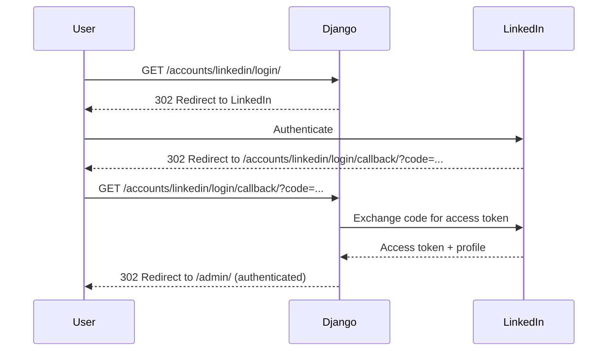

# API Overview

## Introduction

The Social Share Scheduler exposes a minimal API surface focused on administrative functions and webhook integrations. There is **no public REST API** for post creation or management—all user interactions occur through the Django Admin interface.

## API Architecture

The system has two primary API interfaces:

1. **Django Admin Interface** - Form-based UI for managing posts
2. **Inngest Webhook Endpoint** - Server-to-server webhook for workflow execution

## API Endpoints

### Django Admin (Web UI)

**Base URL**: `http://localhost:8000/admin/` (development)

**Authentication**: Django session-based authentication

**Endpoints**:

| URL Pattern | Method | Purpose | Access |
|-------------|--------|---------|--------|
| `/admin/` | GET | Admin homepage | Authenticated users |
| `/admin/login/` | GET, POST | Login page | Public |
| `/admin/logout/` | POST | Logout | Authenticated users |
| `/admin/posts/post/` | GET | List all posts | Authenticated users |
| `/admin/posts/post/add/` | GET, POST | Create new post | Authenticated users |
| `/admin/posts/post/{id}/change/` | GET, POST | Edit existing post | Post owner or superuser |
| `/admin/posts/post/{id}/delete/` | GET, POST | Delete post | Post owner (if unpublished) or superuser |

**Content Type**: `text/html` (HTML forms)

**Authentication Flow**:
1. User accesses `/admin/`
2. If not authenticated, redirect to `/admin/login/`
3. After successful login, redirect back to `/admin/`
4. Session cookie maintains authentication

### LinkedIn OAuth Endpoints

**Provided by**: django-allauth

**Base URL**: `http://localhost:8000/accounts/`

| URL Pattern | Method | Purpose |
|-------------|--------|---------|
| `/accounts/linkedin/login/` | GET | Initiate LinkedIn OAuth |
| `/accounts/linkedin/login/callback/` | GET | OAuth callback from LinkedIn |
| `/accounts/logout/` | POST | Logout user |

**Flow**:


### Inngest Webhook Endpoint

**URL**: `/api/inngest`

**Method**: POST

**Authentication**: 
- Development: None (Inngest dev mode)
- Production: Request signing with `INNGEST_SIGNING_KEY`

**Purpose**: Receive workflow execution requests from Inngest service

**Request Format**:
```json
{
  "event": {
    "name": "inngest/function.invoked",
    "data": {
      "function_id": "post_scheduler",
      "run_id": "01HZABC123...",
      "step": {
        "id": "step-linkedin-share-workflow-step",
        "name": "linkedin-share-workflow-step"
      }
    },
    "ts": 1675000000000
  },
  "steps": [...],
  "ctx": {...}
}
```

**Response Format**:
```json
{
  "status": 200,
  "body": "done"
}
```

**Registered Functions**:
- `post_scheduler` - Handles `posts/post.scheduled` events

**Error Responses**:
```json
{
  "status": 500,
  "error": "Error message"
}
```

## Event API (Inngest)

### Sending Events from Django

**Endpoint**: Inngest service (dev: `http://localhost:8288`, prod: Inngest Cloud)

**Method**: POST to Inngest SDK

**Event Structure**:
```python
inngest.Event(
    name="posts/post.scheduled",
    id="posts/post.scheduled.{post_id}",
    data={"object_id": post_id},
    # ts=optional_timestamp
)
```

**Example**:
```python
from scheduler.client import inngest_client
import inngest

inngest_client.send_sync(
    inngest.Event(
        name="posts/post.scheduled",
        id=f"posts/post.scheduled.{self.id}",
        data={"object_id": self.id}
    )
)
```

**Event Names**:

| Event Name | Trigger | Data Payload |
|------------|---------|--------------|
| `posts/post.scheduled` | Post created with scheduling | `{"object_id": <post_id>}` |

**Event ID Format**: `posts/post.scheduled.{post_id}`

**Purpose**: Event IDs enable idempotency and prevent duplicate workflows

## LinkedIn API Integration

### Base URL

`https://api.linkedin.com`

### Authentication

**Type**: OAuth 2.0 Bearer Token

**Header**:
```
Authorization: Bearer {access_token}
```

### Endpoints Used

#### POST /v2/ugcPosts

**Purpose**: Publish a post to LinkedIn

**Headers**:
```
Authorization: Bearer {access_token}
Content-Type: application/json
X-Restli-Protocol-Version: 2.0.0
```

**Request Body**:
```json
{
  "author": "urn:li:person:{linkedin_user_id}",
  "lifecycleState": "PUBLISHED",
  "specificContent": {
    "com.linkedin.ugc.ShareContent": {
      "shareCommentary": {
        "text": "Your post content here"
      },
      "shareMediaCategory": "NONE"
    }
  },
  "visibility": {
    "com.linkedin.ugc.MemberNetworkVisibility": "PUBLIC"
  }
}
```

**Success Response** (201 Created):
```json
{
  "id": "urn:li:ugcPost:1234567890"
}
```

**Error Responses**:

| Status Code | Meaning | Common Causes |
|-------------|---------|---------------|
| 400 | Bad Request | Invalid post content, missing fields |
| 401 | Unauthorized | Invalid or expired access token |
| 403 | Forbidden | Insufficient permissions, account restricted |
| 429 | Too Many Requests | Rate limit exceeded |
| 500 | Internal Server Error | LinkedIn API issue |

## API Versioning

### Current Version

**Version**: None (no versioned API)

**Django Admin**: Uses Django's built-in admin (no versioning needed)

**Inngest Webhook**: Uses Inngest SDK version (currently latest)

**LinkedIn API**: Uses LinkedIn API v2

### Future Considerations

If a public REST API is added:
- Use URL-based versioning: `/api/v1/posts/`
- Or header-based: `Accept: application/vnd.socialscheduler.v1+json`
- Maintain backward compatibility for at least one major version

## Rate Limiting

### Current Implementation

**None** - No rate limiting implemented

### Recommendations for Production

**Django Admin**:
- Implement rate limiting middleware
- Suggested: 100 requests/minute per user
- Prevent brute force login attempts

**Inngest Webhook**:
- Trust Inngest's rate limiting
- Implement request signing verification
- Add timeout protection

**LinkedIn API**:
- Subject to LinkedIn's rate limits (not documented in code)
- Implement exponential backoff on 429 responses
- Track API usage metrics

## CORS Configuration

**Current**: Not applicable (no browser-based API)

**If REST API added**:
```python
# settings.py
CORS_ALLOWED_ORIGINS = [
    "https://yourdomain.com",
]
```

## API Security

### Django Admin

**Security Measures**:
- CSRF protection on all POST requests
- Session-based authentication
- XSS protection via template auto-escaping
- SQL injection protection via ORM

**Security Gaps**:
- No rate limiting
- No account lockout after failed logins
- HTTP only in development (no HTTPS)

### Inngest Webhook

**Production Security**:
- Request signing with shared secret (`INNGEST_SIGNING_KEY`)
- Signature verification in Inngest SDK
- HTTPS required

**Development Security**:
- No authentication (Inngest dev mode)
- HTTP allowed
- Trusts all requests from localhost:8288

### LinkedIn API

**Security Measures**:
- OAuth 2.0 authorization code flow
- Access tokens stored in database
- HTTPS for all requests

**Security Gaps**:
- Tokens stored in plaintext in database
- No token refresh implemented
- No token expiration handling

## Error Handling

### Django Admin

**Validation Errors**:
- Displayed as form field errors
- User remains on form to correct
- HTTP 200 with error messages in HTML

**Server Errors**:
- HTTP 500
- Django debug page (if `DEBUG=True`)
- Generic error page (if `DEBUG=False`)

### Inngest Webhook

**Workflow Errors**:
- Inngest automatically retries failed steps
- Exponential backoff between retries
- Maximum retry limit enforced by Inngest
- Errors logged to Inngest dashboard

**LinkedIn API Errors**:
- HTTP errors caught with `raise_for_status()`
- Converted to Django `ValidationError`
- Workflow step fails and retries

## API Monitoring

### Current State

**No monitoring implemented**

### Recommendations

**Metrics to Track**:
- Request rate (requests/second)
- Response times (p50, p95, p99)
- Error rates (4xx, 5xx)
- LinkedIn API call success/failure rates
- Inngest workflow execution times

**Tools**:
- Application: Sentry, DataDog, New Relic
- Infrastructure: Prometheus, Grafana
- LinkedIn API: Custom metrics in application logs

## API Documentation Tools

### Current State

**No automated API documentation**

### Recommendations (if REST API added)

**Tools**:
- **Django REST Framework**: For building REST API
- **drf-spectacular**: OpenAPI/Swagger documentation
- **Redoc**: API documentation UI

**Example**:
```python
# urls.py
from drf_spectacular.views import SpectacularAPIView, SpectacularSwaggerView

urlpatterns = [
    path('api/schema/', SpectacularAPIView.as_view(), name='schema'),
    path('api/docs/', SpectacularSwaggerView.as_view(url_name='schema'), name='swagger-ui'),
]
```

## Testing the API

### Django Admin

**Manual Testing**:
1. Navigate to `http://localhost:8000/admin/`
2. Login with test credentials
3. Create/edit/delete posts
4. Verify validation errors
5. Test as superuser vs regular user

**Automated Testing** (not implemented):
```python
from django.test import TestCase, Client

class PostAdminTest(TestCase):
    def test_create_post(self):
        client = Client()
        client.login(username='test', password='test')
        response = client.post('/admin/posts/post/add/', {
            'content': 'Test post',
            'share_now': True,
            'share_on_linkedin': True
        })
        self.assertEqual(response.status_code, 302)
```

### Inngest Webhook

**Manual Testing** (via Jupyter notebook):
```python
# notebooks/05-trigger-inngest-function.ipynb
import inngest
from scheduler.client import inngest_client

inngest_client.send_sync(
    inngest.Event(
        name="posts/post.scheduled",
        id="test-event-1",
        data={"object_id": 123}
    )
)
```

**View in Inngest Dashboard**:
- http://localhost:8288/

### LinkedIn API

**Manual Testing** (via Jupyter notebook):
```python
# notebooks/03-linkedin-user-share.ipynb
from helpers import linkedin
from django.contrib.auth import get_user_model

User = get_user_model()
user = User.objects.get(username='test')
linkedin.post_to_linkedin(user, "Test post content")
```

## API Roadmap

### Current State

- ✅ Django Admin for post management
- ✅ Inngest webhook integration
- ✅ LinkedIn API integration
- ❌ No public REST API
- ❌ No API documentation
- ❌ No rate limiting

### Potential Future API Features

1. **REST API for Post Management**
   - `GET /api/v1/posts/` - List user's posts
   - `POST /api/v1/posts/` - Create post
   - `GET /api/v1/posts/{id}/` - Get post details
   - `PATCH /api/v1/posts/{id}/` - Update post
   - `DELETE /api/v1/posts/{id}/` - Delete post

2. **Webhook API for Third-Party Integrations**
   - Allow external systems to trigger post creation
   - Webhook signatures for security
   - Event notifications for post published

3. **Analytics API**
   - Post performance metrics
   - Engagement statistics from LinkedIn

4. **Bulk Operations API**
   - Bulk post creation from CSV
   - Bulk scheduling
   - Batch status updates
