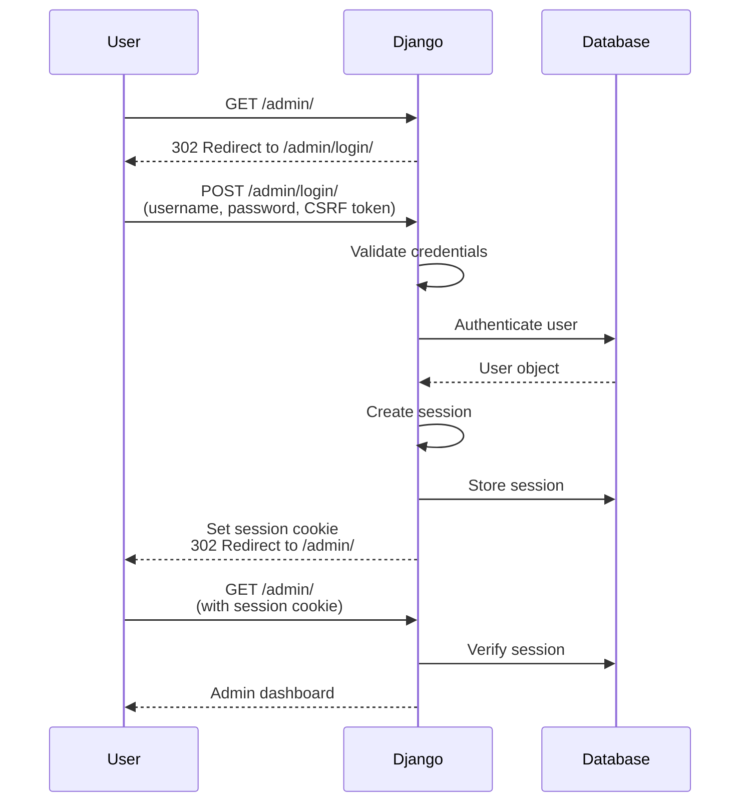
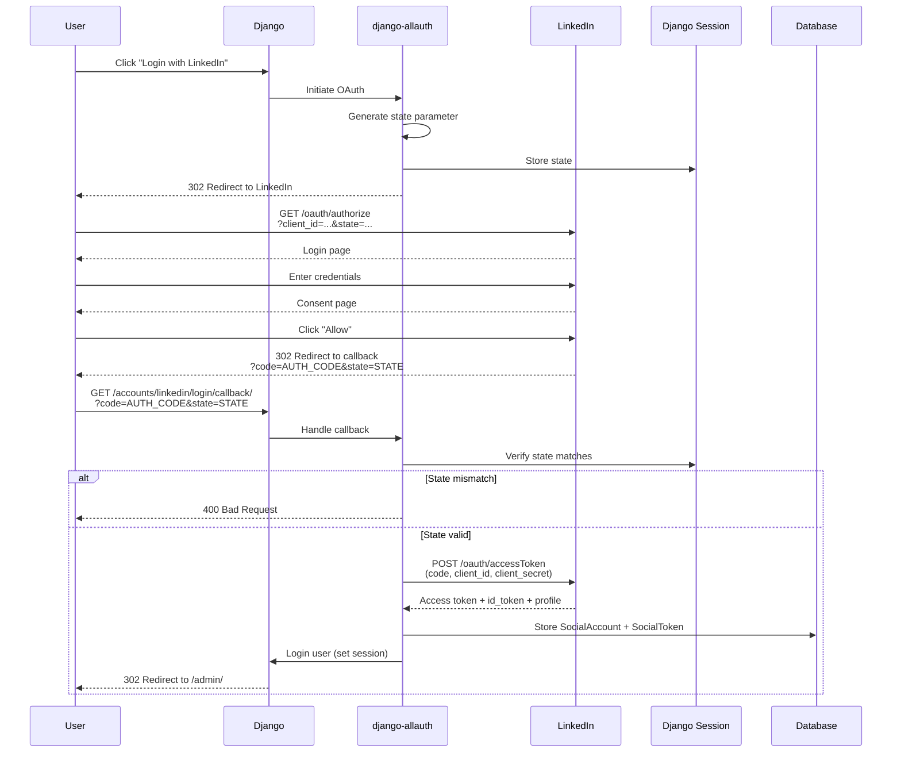

# Authentication

## Overview

The Social Share Scheduler uses multiple authentication mechanisms for different parts of the system:

1. **Django Session Authentication** - For admin interface access
2. **LinkedIn OAuth 2.0** - For linking user LinkedIn accounts
3. **Inngest Request Signing** - For webhook endpoint security (production)

## Django Session Authentication

### Mechanism

**Type**: Cookie-based session authentication

**Flow**:


### Session Storage

**Backend**: Database-backed sessions (default Django)

**Table**: `django_session`

**Session Data**:
- Session key (random string)
- User ID
- Expiration timestamp
- Serialized session data

**Session Cookie**:
- Name: `sessionid`
- HttpOnly: True (prevents JavaScript access)
- Secure: False (dev), True (production with HTTPS)
- SameSite: Lax (CSRF protection)
- Max-Age: 2 weeks (Django default)

### Login Flow

**Endpoint**: `/admin/login/`

**Method**: POST

**Form Fields**:
- `username` - Django username
- `password` - Plain text password (hashed on server)
- `csrfmiddlewaretoken` - CSRF token
- `next` - Optional redirect URL after login

**Password Hashing**:
- Algorithm: PBKDF2_SHA256 (Django default)
- Iterations: 390,000 (Django 4.2+ default)
- Format: `pbkdf2_sha256$390000$<salt>$<hash>`

**Authentication Backends** (`settings.py`):
```python
AUTHENTICATION_BACKENDS = [
    'django.contrib.auth.backends.ModelBackend',
    'allauth.account.auth_backends.AuthenticationBackend',
]
```

### Logout Flow

**Endpoint**: `/admin/logout/`

**Method**: POST

**Actions**:
1. Clear session from database
2. Clear session cookie
3. Redirect to `/admin/login/`

### Session Hijacking Protection

**Measures**:
- CSRF token validation on all state-changing requests
- HttpOnly cookies (prevent XSS session theft)
- Session expiration after 2 weeks of inactivity
- Session rotation on login (new session ID)

**Recommendations for Production**:
- Enable HTTPS everywhere (`SESSION_COOKIE_SECURE = True`)
- Set `SESSION_COOKIE_SAMESITE = 'Strict'`
- Implement session timeout after N minutes of inactivity
- Log IP address changes for active sessions

## LinkedIn OAuth 2.0 Authentication

### Protocol

**Type**: OAuth 2.0 Authorization Code Flow with OpenID Connect

**Provider**: LinkedIn

**Scopes Requested**:
- `openid` - OpenID Connect authentication
- `profile` - User's profile information (name, email)
- `w_member_social` - Permission to post on behalf of user
- `email` - User's email address

### OAuth Flow



### OAuth Configuration

**Configured via Django Admin** (not in code):

| Setting | Value |
|---------|-------|
| Provider | OpenID Connect |
| Provider ID | `linkedin` |
| Name | LinkedIn |
| Client ID | From LinkedIn Developer App |
| Secret | From LinkedIn Developer App |
| Settings (JSON) | `{"scope": ["openid", "profile", "w_member_social", "email"], "server_url": "https://www.linkedin.com/oauth"}` |
| Callback URL (dev) | `http://localhost:8000/accounts/linkedin/login/callback/` |
| Callback URL (prod) | `https://yourdomain.com/accounts/linkedin/login/callback/` |

### Access Token Storage

**Table**: `socialaccount_socialtoken`

**Fields**:
- `token` - Access token (plaintext)
- `token_secret` - OAuth 1.0 secret (not used for OAuth 2.0)
- `expires_at` - Token expiration (if provided by LinkedIn)
- `account_id` - Foreign key to SocialAccount

**Security Consideration**:
> **Warning**: Access tokens are stored in **plaintext** in the database. Consider encrypting sensitive fields in production.

### Token Retrieval (in code)

```python
from helpers.linkedin import get_share_headers

linkedin_social = user.socialaccount_set.get(provider="linkedin")
tokens = linkedin_social.socialtoken_set.all()
social_token = tokens.first()
access_token = social_token.token
```

### Token Expiration Handling

**Current**: No automatic token refresh

**Behavior when token expires**:
1. LinkedIn API returns 401 Unauthorized
2. Workflow step fails
3. Inngest retries (fails again)
4. User must manually re-authenticate

**Recommended**: Implement token refresh flow (LinkedIn supports refresh tokens)

### State Parameter (CSRF Protection)

**Purpose**: Prevent CSRF attacks in OAuth callback

**Implementation**:
- `state` parameter generated by django-allauth
- Stored in Django session before redirect to LinkedIn
- Verified on callback to ensure request originated from same user

**Security**:
- Prevents attackers from tricking users into linking their account
- Prevents session fixation attacks

## Inngest Webhook Authentication

### Development Mode

**Authentication**: None

**Configuration**:
```bash
INNGEST_DEV=1
```

**Security**:
- Inngest dev server runs locally
- All requests from `localhost:8288` are trusted
- No signature verification

**Risk**: Accept for local development only

### Production Mode

**Authentication**: Request signature verification

**Configuration**:
```bash
INNGEST_EVENT_KEY=<event-key>
INNGEST_SIGNING_KEY=<signing-key>
INNGEST_SIGNING_KEY_FALLBACK=<fallback-key>
```

**How It Works**:
1. Inngest signs webhook requests with shared secret (`INNGEST_SIGNING_KEY`)
2. Signature included in `X-Inngest-Signature` header
3. Django validates signature using Inngest SDK
4. Invalid signatures rejected with 401

**Signature Format**:
```
X-Inngest-Signature: t=<timestamp>,s=<signature>
```

**Signature Algorithm**:
- HMAC-SHA256
- Payload: Request body + timestamp
- Secret: `INNGEST_SIGNING_KEY`

**Key Rotation**:
- `INNGEST_SIGNING_KEY_FALLBACK` allows graceful key rotation
- Accept both old and new keys during transition

## Authorization (Permissions)

### Django Admin Permissions

**User Roles**:
1. **Anonymous** - No access
2. **Authenticated (Regular User)** - Limited access
3. **Staff** - Full admin access to own data
4. **Superuser** - Full admin access to all data

**Permission Model**:

| Action | Regular User | Superuser |
|--------|--------------|-----------|
| View own posts | ✅ | ✅ |
| View other's posts | ❌ | ✅ |
| Create post | ✅ | ✅ |
| Edit own unpublished post | ✅ | ✅ |
| Edit own published post | ❌ | ✅ |
| Edit other's post | ❌ | ✅ |
| Delete own unpublished post | ✅ | ✅ |
| Delete own published post | ❌ | ✅ |
| Delete other's post | ❌ | ✅ |

**Implementation** (`posts/admin.py`):
```python
class PostAdmin(admin.ModelAdmin):
    def get_queryset(self, request):
        qs = super().get_queryset(request)
        if request.user.is_superuser:
            return qs
        return qs.filter(user=request.user)
    
    def has_delete_permission(self, request, obj=None):
        if request.user.is_superuser:
            return True
        if obj is None:
            return False
        return obj.user == request.user and not obj.shared_at_linkedin
```

### LinkedIn API Authorization

**Scopes Required**:
- `w_member_social` - Post to LinkedIn on user's behalf

**Scope Verification**:
- LinkedIn enforces scopes during OAuth consent
- Access token only valid for granted scopes
- Attempting actions outside scope returns 403 Forbidden

**Permission Revocation**:
- User can revoke access via LinkedIn settings
- Access token immediately invalidated
- No webhook notification to our app
- Next API call returns 401 Unauthorized

## Security Best Practices

### Implemented

✅ CSRF protection on all POST requests
✅ Password hashing with PBKDF2
✅ HttpOnly session cookies
✅ OAuth state parameter validation
✅ User-scoped queryset filtering

### Not Implemented (Recommendations)

❌ **HTTPS Everywhere**
- Current: HTTP in development
- Recommended: Enforce HTTPS in production (`SECURE_SSL_REDIRECT = True`)

❌ **Account Lockout**
- Current: No limit on failed login attempts
- Recommended: Lock account after N failed attempts

❌ **Two-Factor Authentication**
- Not implemented
- Consider django-otp for 2FA

❌ **Token Encryption**
- Current: Tokens stored in plaintext
- Recommended: Encrypt `socialaccount_socialtoken.token` field

❌ **API Rate Limiting**
- No rate limiting on admin endpoints
- Recommended: django-ratelimit

❌ **Security Headers**
- Missing: HSTS, CSP, X-Content-Type-Options
- Recommended: django-security middleware

## Authentication Testing

### Manual Testing

**Test Login**:
```bash
curl -c cookies.txt \
  -d "username=testuser&password=testpass&csrfmiddlewaretoken=$(grep csrftoken cookies.txt | awk '{print $7}')" \
  http://localhost:8000/admin/login/
```

**Test OAuth Flow**:
1. Navigate to `http://localhost:8000/accounts/linkedin/login/`
2. Click "Allow" on LinkedIn
3. Verify redirect to `/admin/`
4. Check `socialaccount_socialaccount` table for new record

### Automated Testing

**Not currently implemented**

**Recommended Tests**:
```python
from django.test import TestCase, Client

class AuthenticationTest(TestCase):
    def test_login_required(self):
        response = self.client.get('/admin/')
        self.assertEqual(response.status_code, 302)
        self.assertIn('/admin/login/', response.url)
    
    def test_successful_login(self):
        self.client.login(username='test', password='test')
        response = self.client.get('/admin/')
        self.assertEqual(response.status_code, 200)
```
